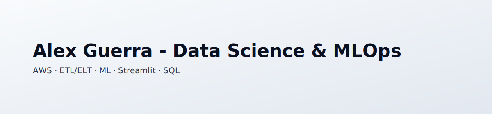

# 👋 Hola, soy Alex — Data Scientist en camino a MLOps

  <picture>
    <source media="(prefers-color-scheme: dark)" srcset="assets/banner-dark.svg">
    
  </picture>

## 🚀 Sobre mí
- 🎓 Bootcamp en Data Science & Machine Learning (Hack a Boss)
- ☁️ Pipelines en AWS (S3, Lambda, RDS)
- 🤖 ML con scikit-learn y TensorFlow
- 📊 Streamlit y SQL

## 📂 Proyectos destacados
- RAWG Video-Games Data Platform
- TMDB Movie EDA & Success Prediction
- Passenger Satisfaction Classifier
- Spam Filter (Enron Corpus)
- Excel → PDF Converter (macOS)
